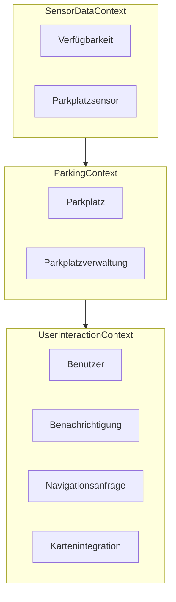

# Bounded Context

```mermaid
flowchart TB
    %% Subgraphen definieren
    subgraph ParkingContext
        Parkplatz
        Parkplatzverwaltung
    end

    subgraph UserInteractionContext
        Benutzer
        Benachrichtigung
        Navigationsanfrage
        Kartenintegration
    end

    subgraph SensorDataContext
        Verfügbarkeit
        Parkplatzsensor
    end

    %% Verbindungen zwischen den Kontexten definieren
    SensorDataContext --> ParkingContext
    ParkingContext --> UserInteractionContext
```
