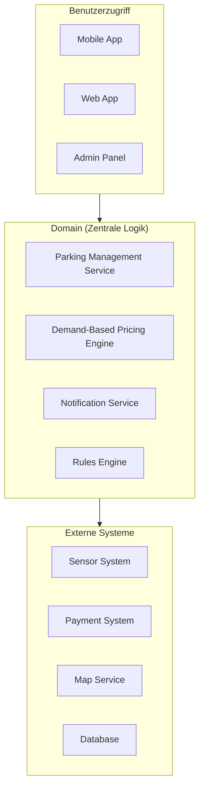

# Basic Modules

```mermaid
flowchart TB
%% Domain (Zentrales Modul)
subgraph Domain ["Domain (Zentrale Logik)"]
ParkingManagementService["Parking Management Service"]
DemandPricingEngine["Demand-Based Pricing Engine"]
NotificationService["Notification Service"]
RulesEngine["Rules Engine"]
end

    %% Externe Systeme
    subgraph ExternalSystems ["Externe Systeme"]
        SensorSystem["Sensor System"]
        PaymentSystem["Payment System"]
        MapService["Map Service"]
        Database["Database"]
    end

    %% Nutzerzugriffe
    subgraph UserAccess ["Benutzerzugriff"]
        MobileApp["Mobile App"]
        WebApp["Web App"]
        AdminPanel["Admin Panel"]
    end

    %% Verbindungen
    UserAccess --> Domain
    Domain --> ExternalSystems
```
