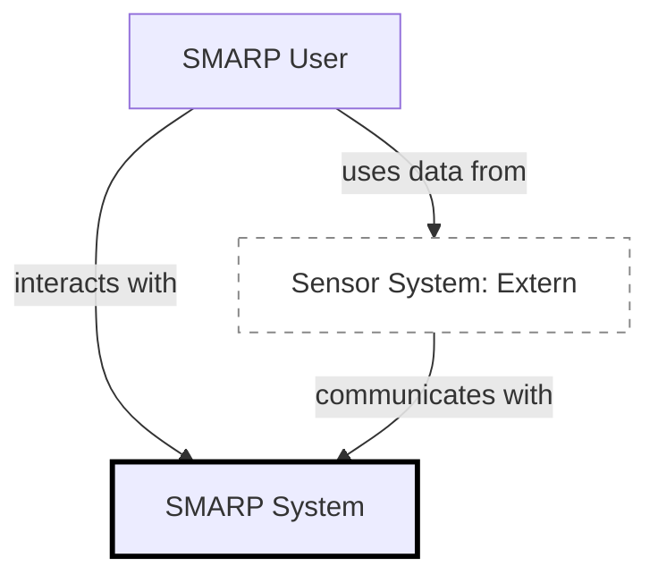

# Level 1 Context

## Beschreibung

- 1.Sensor System is extern placed
- 2.SMARP User is the User of the APP/Programm
- 3.SMARP System is the main Process

```mermaid

graph TD
    A[SMARP System]:::thickBorder
    B[SMARP User] -->|interacts with| A
    C[Sensor System: Extern]:::external -->|communicates with| A
    B -->|uses data from| C

    classDef thickBorder stroke-width:3px,stroke:#000;
    classDef external stroke-dasharray: 5 5, fill:none, stroke:#888;

```
