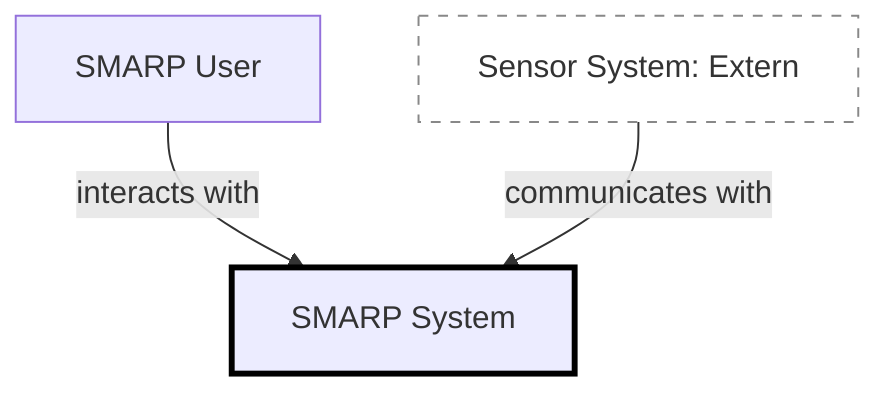

## Level 1 Context

```mermaid
graph TD
    A[SMARP System]:::thickBorder
    B[SMARP User] -->|interacts with| A
    C[Sensor System: Extern]:::external -->|communicates with| A

    classDef thickBorder stroke-width:3px,stroke:#000;
    classDef external stroke-dasharray: 5 5, fill:none, stroke:#888;
```

