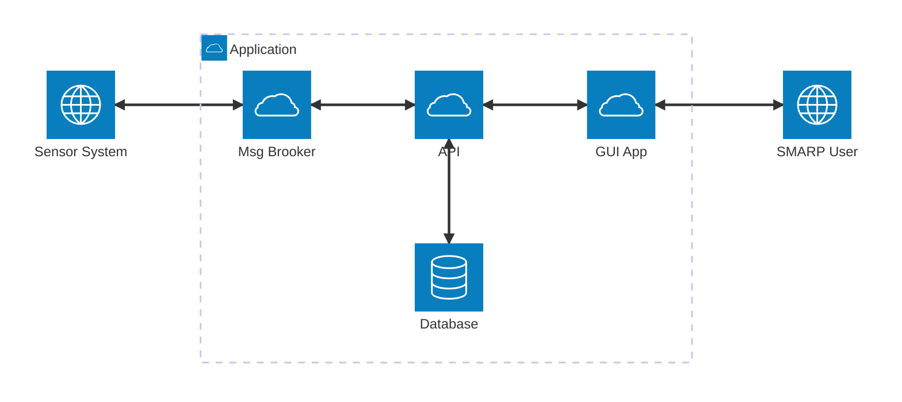

# C4 Level 2 - Containers

```mermaid
architecture-beta
    group application(cloud)[Application]

    service db(database)[Database] in application
    service api(cloud)[API] in application
    service gui_app(cloud)[GUI App] in application
    service msg_brooker(cloud)[Msg Brooker] in application

    service smarp_user(internet)[SMARP User]

    service sensor_system(internet)[Sensor System]

    smarp_user:L >--> R:gui_app
    msg_brooker:L <--> R:sensor_system
    api:L <--> R:msg_brooker
    gui_app:L >--> R:api

    db:T <--> B:api

```
