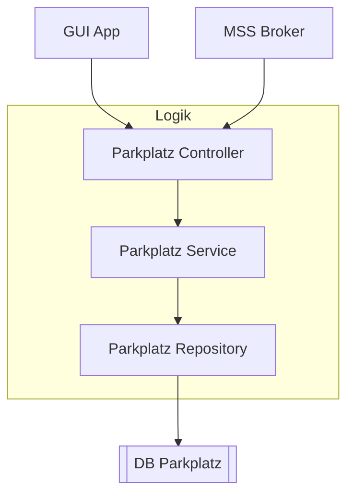

# Level 3 Components

```mermaid
graph TD
    GUI_App["GUI App"] --> Parkplatz_Controller["Parkplatz Controller"]
    MSS_Broker["MSS Broker"] --> Parkplatz_Controller
    Parkplatz_Controller --> Parkplatz_Service["Parkplatz Service"]
    Parkplatz_Service --> Parkplatz_Repository["Parkplatz Repository"]
    Parkplatz_Repository --> DB_Parkplatz[["DB Parkplatz"]]

    %% Umrandung
    subgraph Logik
        Parkplatz_Controller
        Parkplatz_Service
        Parkplatz_Repository
    end
```
