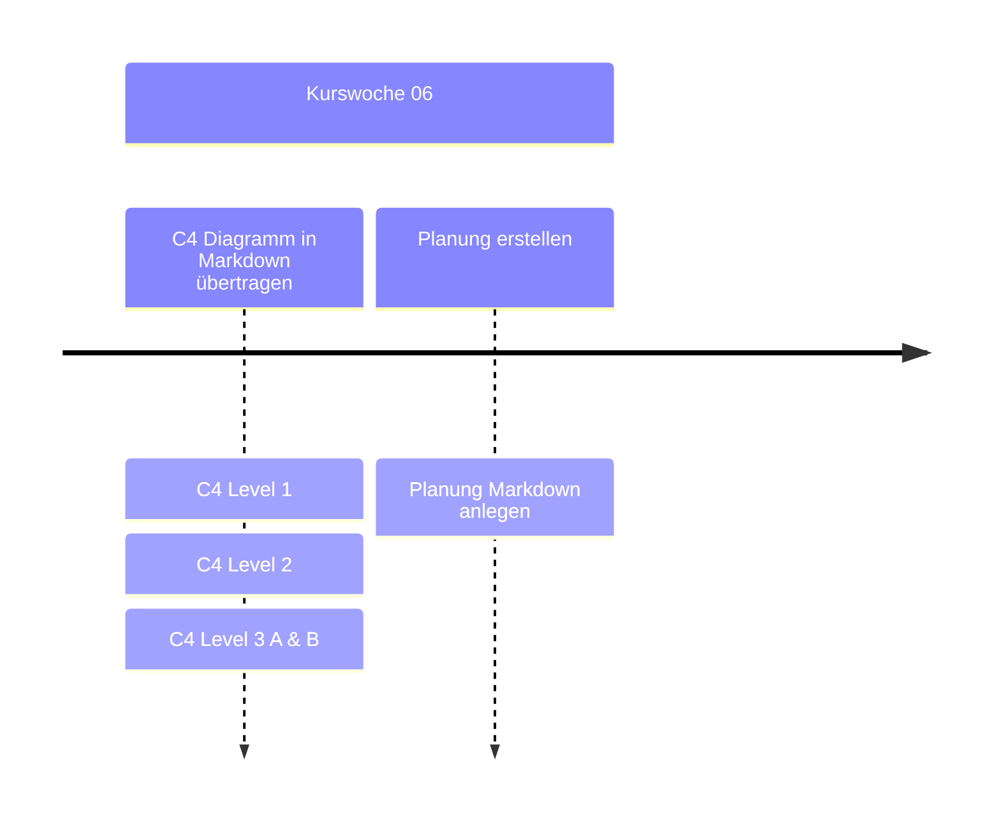
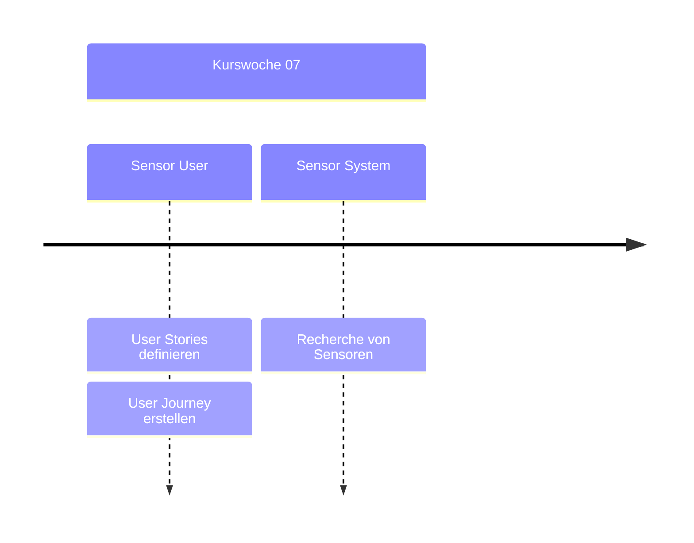

# Planung

## Kurswoche 06

```mermaid
timeline
        section Kurswoche 06
          C4 Diagramm in Markdown übertragen : C4 Level 1 : C4 Level 2 : C4 Level 3 A & B
          Planung erstellen : Planung Markdown anlegen
```

## Kurswoche 07

```mermaid
timeline
        section Kurswoche 07
          Sensor User : User Stories definieren : User Journey erstellen
          Sensor System : Recherche von Sensoren
```
